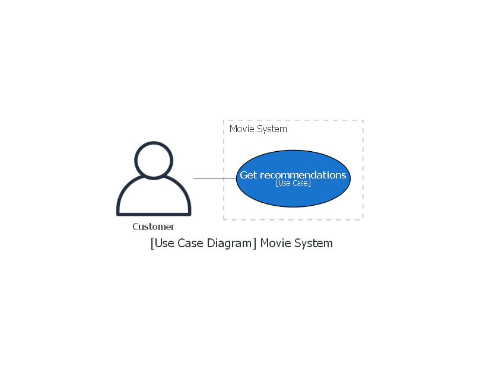
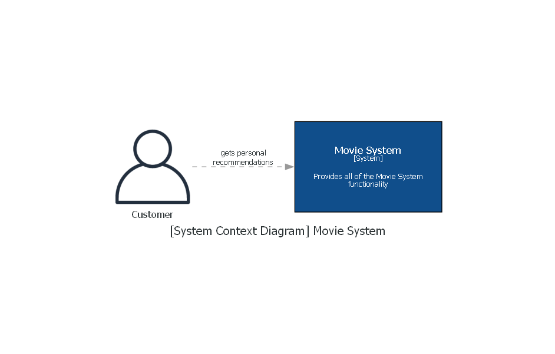
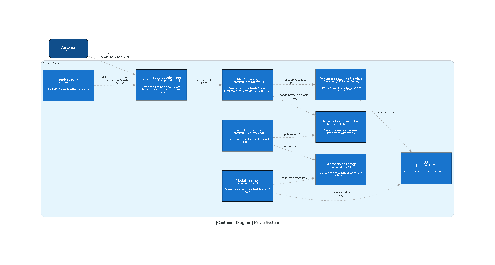
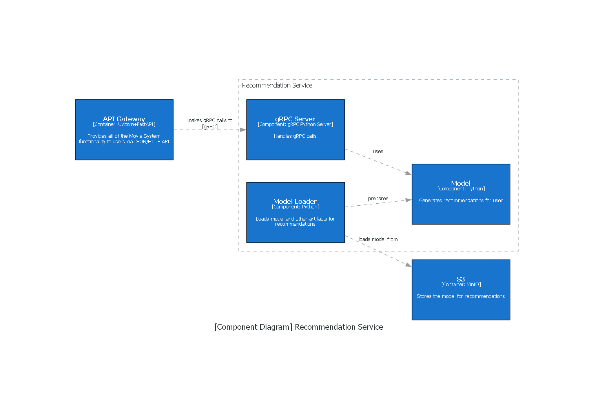

## Диаграммы

### Генерация
```bash
git clone https://github.com/Daniil-Solo/itmo-ml-big-data-course.git
cd itmo-ml-big-data-course
python -m venv venv
venv\Scripts\activate.bat
cd homework-1
pip install -r requirements.txt

python src/use_case.py
```

### Диаграмма Use Case


### С4-диаграмма контекста системы


### С4-диаграмма контейнеров


### С4-диаграмма компонентов сервиса рекомедаций



